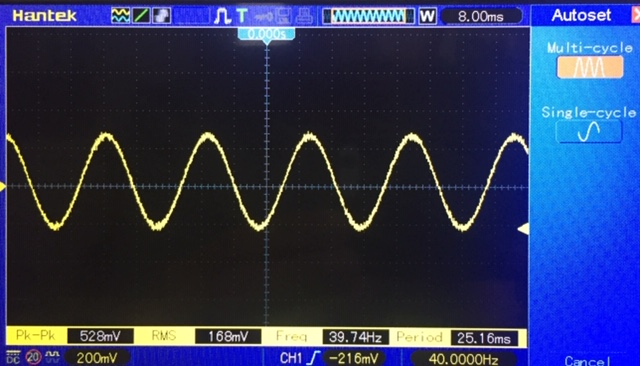

# Signal Generator

Electronic circuits may need a signal of known waveform (sinus, sawtooth, square...), amplitude and frequency during the development stage. 
This python scripts uses the audio board of your computer to generate such signal.
The signal is saved as a short wave file readable by any player. The player is then set to loop and the signal recovered from the output of the audio card.
No exotic module needed; the modules come with the default Anaconda install.

